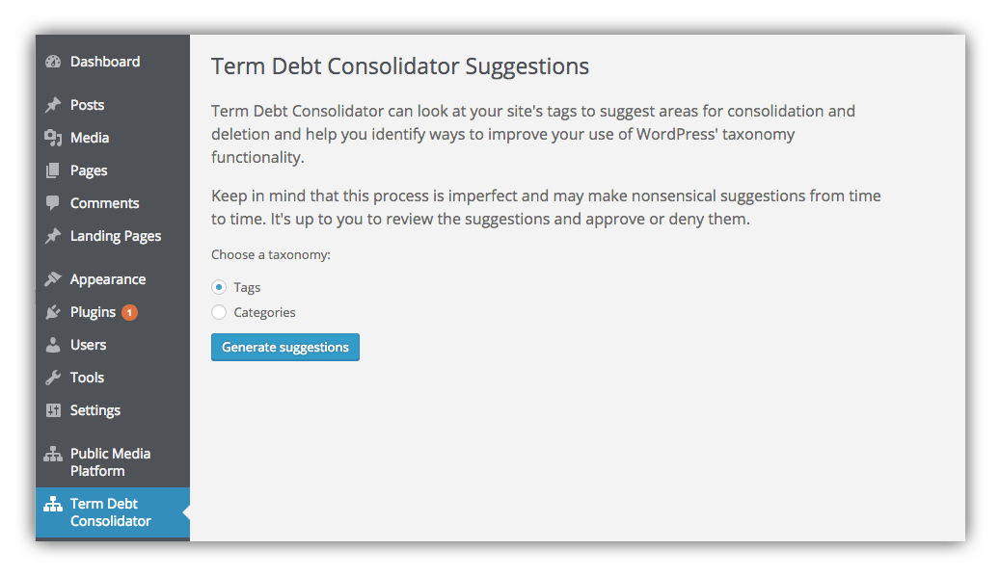
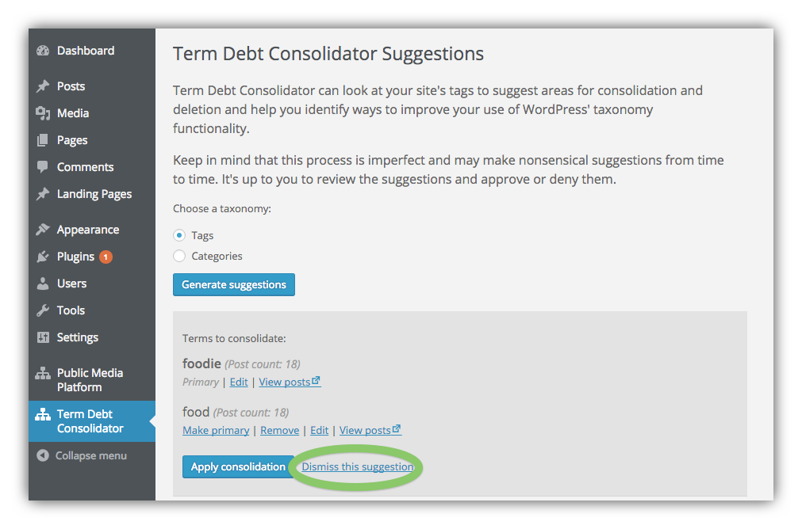
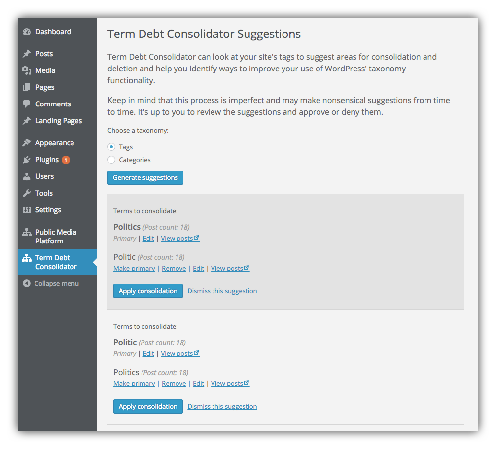

# Using the Term Debt Consolidator

Term Debt Consolidator can look at your WordPress site's tags to suggest areas for consolidation and deletion and help you identify ways to improve your use of WordPress' taxonomy functionality.

Keep in mind that this process is imperfect and may make nonsensical suggestions from time to time. It's up to you to review the suggestions and approve or deny them.

## Installation

Term Debt Consolidator can be installed like any other WordPress plugin.

1. Install the plugin through the WordPress plugins screen directly, or download the zip file from this Github repo and install manually to your WordPress site.
2. Activate the plugin through the 'Plugins' screen in WordPress
3. Use the plugin via the **Term Debt Consolidator** link in the WordPress dashboard

## Using the Term Debt Consolidator

Choose which taxonomy you wish to have the plugin review for consolidation. By default you can choose between Tags and Categories. _If you have any custom taxonomies you'd like to consolidate, please see the instructions for [adding taxonomies to the plugin](taxonomies.md)_.

Hit the **Generate Suggestions** button and after processing the taxonomy, you'll get a list of suggested terms to consolidate:

Note what you can do with the list of suggestions:

- Edit any of the terms listed
- View posts for the term on the term archive page
- Make primary one of the terms being compared, so as to consolidate the terms
- Remove one of the terms being compared

If the Term Debt Consolidator suggests consolidating terms you wish to keep separate, you can **Dismiss this suggestion**:

After dismissing the suggestion, Term Debt Consolidator won't show it again.

## Choosing Which Term to Make Primary

Of course for any given pair of terms being suggested for consolidation, it's your choice which term to make primary or remove. Just note that for each pair the Term Debt Consolidator displays two rows for each pair:

In this case we'd probably want to make "Politics" the primary term, and remove "Politic" which was probably a typo in the first place. 

So we'd want to:

- Click "Make primary" for "Politics"
- Click "Remove" for "Politic"
- Finally, click the **Apply consolidation** button